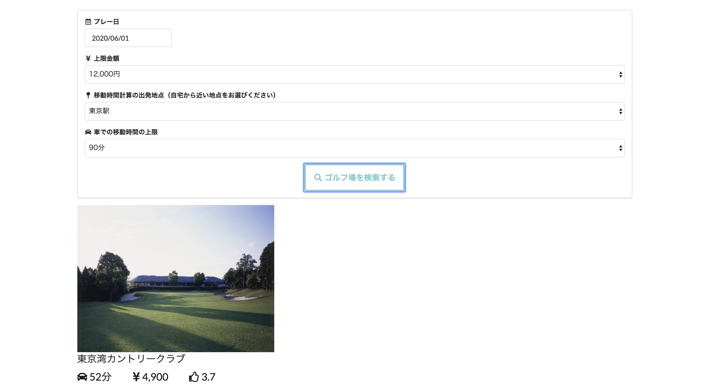
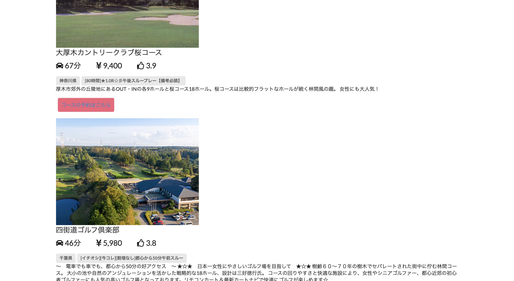

# Golf Search App

    
    

このアプリケーションは、RakutenAPI と GoogleMapsAPI を利用して、東京近郊のゴルフ場を検索し、そこまでの距離と価格を表示させるアプリです。

Techpit(https://www.techpit.jp/)
の教材を購入して読みながら制作しました。

## URL

https://master.d2t2s2ypbks5dq.amplifyapp.com/

## 開発背景

主に 3 つある。

- React の基本的な概念や記述方法の理解を深め、自身のスキルセットにこのフレームワークを追加したかったから。

- スクールで学習した Ruby と AWS の理解をさらに深める。特に、Lambda, Amplify, API Gateway, DynamoDB など、複数の AWS のサービスを利用して、実装してみたかったから。

- Rakuten, Google Maps などの外部の API から取得したデータを利用したかったから。

## 技術

- React.js
- Ruby
- AWS
  - AWS Amplify
  - API Gateway
  - Lambda
  - DynamoDB
- Git

## 苦労したところ

- lambda_function.rb に Lambda 関数に処理させる際、RakutenAPI と GoogleMapsAPI の値を両方利用した記述をする必要があったため、理解に苦しんだ。

- API Gateway を利用して、Lambda に送る API の作成と、その流れの理解に時間を費やした。
